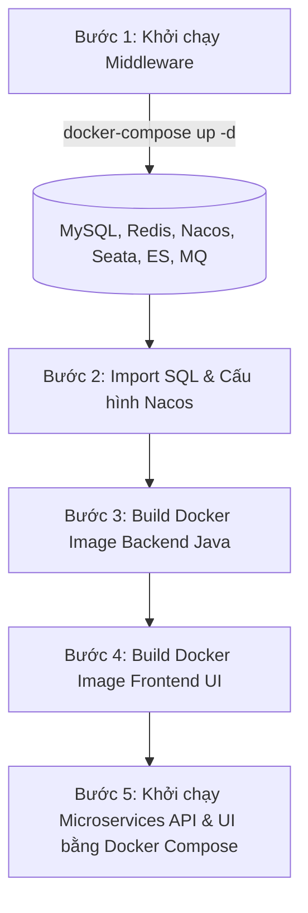

# 🛠️ Hướng Dẫn Review Source Code & Triển Khai Local Bằng Docker Compose

Tài liệu này cung cấp kết quả **review cấu trúc mã nguồn (Source Code)** và **hướng dẫn chi tiết từng bước** để biên dịch (build) toàn bộ Backend Java, Frontend UI và khởi chạy hệ thống trên máy cục bộ (Local) bằng **Docker Compose**.

---

## 🔍 1. Review Cấu Trúc Mã Nguồn (Source Code Review)

Hệ thống mã nguồn của **XianZhu / Lilishop** được chia thành 2 thư mục chính nằm trong `source-code/`:

```text
source-code/
├── S2B2B2C-Service/            # Mã nguồn Backend (Java Spring Boot / Spring Cloud Microservices)
└── S2B2B2C-UI/                 # Mã nguồn Frontend (Vue.js / Node.js Apps)
```

### ☕ 1.1 Backend Service (`source-code/S2B2B2C-Service`)

* **Công nghệ:** Java 21+, Maven Multi-module, Spring Boot, Spring Cloud (Gateway, Nacos, Seata), MyBatis-Plus, Redis, RabbitMQ, Elasticsearch.
* **Cấu trúc Module chính:**
  * 🌐 `gateway/`: API Gateway chính (Port `8888`) tiếp nhận và định tuyến toàn bộ request.
  * 🧰 `framework/`: Các module dùng chung (Security, Cache, Database Config, Exception Handling, Log).
  * 📦 `lilishop-sdk/`: Các bộ SDK tích hợp thanh toán (WeChat Pay, Alipay), SMS, OSS.
  * ⚙️ `service/`: Bao gồm các Microservices xử lý nghiệp vụ chính:
    * `manager-api`: API phục vụ trang Quản trị sàn.
    * `seller-api`: API phục vụ trang Nhà bán hàng / Gian hàng.
    * `supplier-api`: API phục vụ trang Nhà cung cấp sỉ.
    * `buyer-api`: API phục vụ ứng dụng Mua hàng Khách hàng.
    * `consumer`: Xử lý các tác vụ bất đồng bộ từ RabbitMQ & đồng bộ Elasticsearch index.
    * `im-api`: Dịch vụ WebSocket Chat trực tiếp (Port `11130`).

### 🎨 1.2 Frontend UI (`source-code/S2B2B2C-UI`)

* **Công nghệ:** Vue.js (Vue 2 / Vue 3), Element UI / Ant Design Vue, Axios, Nginx.
* **Cấu trúc Sub-apps:**
  * 🖥️ `manager/`: Giao diện Admin quản trị nền tảng.
  * 🏪 `seller/`: Giao diện Cổng gian hàng cho Thương gia.
  * 🚚 `supplier-platform/`: Giao diện Cổng nhà cung cấp nguồn hàng.
  * 🛍️ `buyer/`: Giao diện Khách hàng mua sắm trên PC Web.
  * 💬 `im/`: Giao diện Chat trực tuyến.

---

## 🔄 2. Quy Trình Triển Khai Local Tổng Quan



---

## ⚡ 3. Giải Pháp Chạy Ứng Dụng Trên Máy Cấu Hình Thấp (2 CPU / 4GB RAM)

> ⚠️ **Đánh giá thực tế:** Mặc định toàn bộ hạ tầng Full Stack (Production Mode) ngốn khoảng **12GB - 16GB RAM**. Nếu chạy cấu hình mặc định trên **2 CPU / 4GB RAM**, hệ thống sẽ bị **Out of Memory (OOM Killer)** lập tức.
>
> 💡 **Giải pháp Tối ưu hóa Cực hạn (Extreme Low-Memory Strategy):** Để chạy được trên **2 CPU / 4GB RAM**, chúng ta bắt buộc áp dụng các thủ thuật dưới đây:

### **Thủ thuật 1: Tắt các dịch vụ chưa cần thiết khi Dev Local (Tiết kiệm ~2.5GB RAM)**
* **Tắt Kibana & Logstash:** Dùng lệnh `docker logs -f <container_name>` để xem log thay vì chạy ELK.
* **Tắt Seata:** Không bật container Seata nếu chưa test giao dịch phân tán phức tạp.
* **Chỉ bật các Microservices cốt lõi:** Bật `gateway`, `auth-api`, `goods-api`, `order-api`. Tạm thời chưa bật các service vệ tinh (`broadcast`, `statistics`, `im-api`).

### **Thủ thuật 2: Giới hạn RAM (JVM Memory Tuning) Cực Hạ Cho Từng Container**

Thay thế dung lượng RAM mặc định trong file `docker-compose.yml`:

| Dịch vụ | RAM Mặc định | RAM Tối ưu cho 4GB | Cấu hình tham số điều chỉnh |
| :--- | :--- | :--- | :--- |
| **Nacos** | `1024 MB` | **`256 MB`** | `JVM_XMS=64m`, `JVM_XMX=256m` |
| **Elasticsearch** | `512 MB - 1 GB` | **`256 MB`** | `ES_JAVA_OPTS=-Xms128m -Xmx256m` |
| **MySQL 8.0** | `500 MB - 1 GB` | **`256 MB`** | `--innodb_buffer_pool_size=128M` |
| **RabbitMQ** | `400 MB` | **`200 MB`** | Thêm `--memory-high-watermark-absolute 200MB` |
| **Các Java Microservices** | `1 GB / service` | **`128 MB / service`** | `JAVA_OPTS="-Xms64m -Xmx128m -XX:MaxMetaspaceSize=128m"` |

### **Thủ thuật 3: Bật bộ nhớ ảo Swap Space (Tối thiểu 4GB Swap)**
Trên Linux/macOS, tạo file Swap để hỗ trợ khi RAM vật lý chạm ngưỡng 4GB:
```bash
# Tạo Swap file 4GB trên Linux
sudo fallocate -l 4G /swapfile
sudo chmod 600 /swapfile
sudo mkswap /swapfile
sudo swapon /swapfile
```

### **Thủ thuật 4: Sử dụng file cấu hình sẵn `docker-compose-dev-minimal.yml` siêu nhẹ**
Chúng ta đã tạo sẵn file cấu hình dành riêng cho máy Dev Local: [deploy/docker-compose-dev-minimal.yml](../deploy/docker-compose-dev-minimal.yml). File này đã gộp Middleware + 5 Core Microservices chính (`gateway`, `auth-api`, `goods-api`, `order-api`, `user-api`), cài đặt giới hạn Heap JVM `-Xmx128m` và Memory limit cho từng container. Tổng dung lượng RAM chạy toàn bộ stack chỉ khoảng **2.3GB - 2.8GB RAM**!

---

## 🚀 4. Hướng Dẫn Chi Tiết Từng Bước Triển Khai

### 4.1 Bước 1: Khởi Chạy File Đã Tối Ưu Cho Dev Local (`docker-compose-dev-minimal.yml`)

```bash
# 1. Di chuyển vào thư mục deploy
cd /Volumes/Data/WorkSpace/XianZhu/deploy

# 2. Cấp quyền truy cập cho thư mục dữ liệu local
chmod -R 777 ../volumes/data/es7 2>/dev/null || true
chmod -R 777 ../volumes/data/mysqldata 2>/dev/null || true

# 3. Khởi chạy bằng file cấu hình tối ưu siêu nhẹ dành cho Dev Local
docker-compose -f docker-compose-dev-minimal.yml up -d

# 4. Kiểm tra danh sách container đang chạy
docker-compose -f docker-compose-dev-minimal.yml ps
```

📌 **Địa chỉ kiểm tra dịch vụ Middleware:**
* **Nacos Dashboard:** `http://localhost:8848/nacos` (Tài khoản: `nacos` / `nacos`)
* **XXL-JOB Admin:** `http://localhost:9001` (Tài khoản: `admin` / `111111`)
* **RabbitMQ Management:** `http://localhost:15672` (Tài khoản: `adminr` / `r123456`)

---

### 4.2 Bước 2: Nạp Dữ Liệu SQL Khởi Tạo

```bash
# Import SQL file vào container MySQL
docker exec -i mysql mysql -uroot -plilishop lilishop < ./kubernetes/middleware/mysql/init/lilishop.sql 2>/dev/null || true
```

---

### 4.3 Bước 3: Biên Dịch & Đóng Gói Backend Java (S2B2B2C-Service)

```bash
# 1. Di chuyển tới thư mục Backend
cd /Volumes/Data/WorkSpace/XianZhu/source-code/S2B2B2C-Service

# 2. Thiết lập môi trường JDK 21+
export JAVA_HOME=/opt/jdk-21.0.2  # Điều chỉnh theo đường dẫn JDK trên máy bạn
export PATH=$JAVA_HOME/bin:$PATH

# 3. Biên dịch dự án và đóng gói file JAR
mvn clean package -DskipTests
```

---

### 4.4 Bước 4: Biên Dịch & Đóng Gói Frontend UI (S2B2B2C-UI)

```bash
# 1. Di chuyển tới thư mục UI
cd /Volumes/Data/WorkSpace/XianZhu/source-code/S2B2B2C-UI

# 2. Build giao diện bằng Node.js / Yarn
yarn install
yarn build

# 3. Đóng gói Docker Image cho Frontend UI
docker build -t local/s2b2b2c-ui:latest -f Dockerfile .
```

---

### 4.5 Bước 5: Khởi Chạy Các Service Microservices Bằng Docker Compose

```bash
# Di chuyển tới thư mục dịch vụ deploy
cd /Volumes/Data/WorkSpace/XianZhu/deploy/service

# Khởi chạy các API Services
docker-compose up -d

# Kiểm tra trạng thái toàn bộ dịch vụ đang chạy
docker-compose ps
```

---

## 📊 5. Bảng Tra Cứu Cổng Dịch Vụ (Service Port Reference)

| Tên Service Container | Cổng Nội Bộ | Cổng Public Local | Mô Tả Chức Năng |
| :--- | :--- | :--- | :--- |
| `gateway` | `8888` | **`8888`** | Cổng Gateway định tuyến API chính |
| `im-api` | `11130` | **`11130`** | WebSocket Chat dịch vụ tức thời |
| `mysql` | `3306` | `3306` | Cơ sở dữ liệu chính |
| `redis` | `6379` | `6379` | Cache & Khóa phân tán |
| `nacos` | `8848` | `8848` | Service Registry & Config Center |
| `rabbitmq` | `5672` / `15672` | `15672` | RabbitMQ Management Web |
| `xxl-job` | `9001` | `9001` | Quản lý tác vụ Scheduler |

---

## 🛠️ 6. Xử Lý Lỗi Thường Gặp (Troubleshooting)

1. **Lỗi `Connection Refused` kết nối MySQL / Nacos khi API vừa khởi chạy:**
   * *Nguyên nhân:* Nacos hoặc MySQL chưa khởi động xong hoàn toàn.
   * *Khắc phục:* Chờ 30 - 60 giây sau khi chạy `docker-compose up -d` ở thư mục `deploy` rồi mới bật các container dịch vụ API.

2. **Lỗi RAM / Memory OOM trên Docker Desktop:**
   * *Nguyên nhân:* RAM mặc định ngốn lớn hơn 4GB.
   * *Khắc phục:* Áp dụng cấu hình JVM Max Heap `-Xmx128m` cho từng service và bật 4GB Swap Space.
