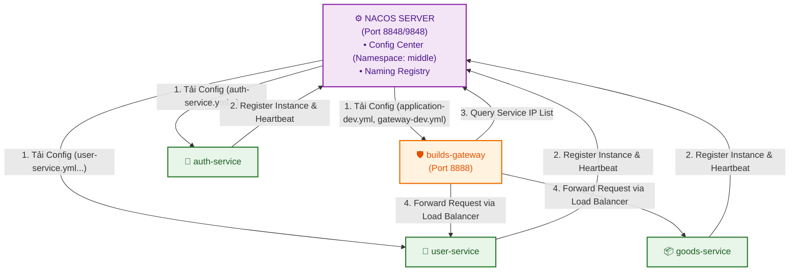

# 📘 Nacos Architecture & Operations Guide (Hướng Dẫn Chi Tiết Về Nacos)

Tài liệu này giải thích chi tiết về **Nacos (Alibaba Nacos)**: Nacos là gì, cơ chế hoạt động cốt lõi, tại sao hệ thống Microservices lại cần Nacos, và cách Nacos vận hành trong dự án **XianZhu / Lilishop S2B2C**.

---

## 📑 Mục lục
1. [Nacos là gì?](#1-nacos-là-gì)
2. [Hai chức năng cốt lõi của Nacos](#2-hai-chức-năng-cốt-lõi-của-nacos)
   - [A. Service Discovery & Registration (Đăng ký & Phát hiện Dịch vụ)](#a-service-discovery--registration-đăng-ký--phát-hiện-dịch-vụ)
   - [B. Dynamic Configuration Management (Quản lý Cấu hình Động)](#b-dynamic-configuration-management-quản-lý-cấu-hình-động)
3. [Các khái niệm cơ bản trên Nacos Dashboard](#3-các-khái-niệm-cơ-bản-trên-nacos-dashboard)
4. [Sơ đồ hoạt động trong hệ thống XianZhu S2B2C](#4-sơ-đồ-hoạt-động-trong-hệ-thống-xianzhu-s2b2c)
5. [Quy trình một Java Microservice kết nối Nacos](#5-quy-trình-một-java-microservice-kết-nối-nacos)
6. [Hướng dẫn thao tác & Mẹo Debug Nacos](#6-hướng-dẫn-thao-tác--mẹo-debug-nacos)
7. [Hướng dẫn Khởi tạo & Publish Cấu hình (Gen / Import Nacos Configs)](#7-hướng-dẫn-khởi-tạo--publish-cấu-hình-gen--import-nacos-configs)

---

## 1. Nacos là gì?

**Nacos** (viết tắt của *Naming and Configuration Service*) là một hạ tầng trung gian do **Alibaba** phát triển, nhằm giải quyết bài toán lớn nhất của hệ thống **Microservices**:

> ❓ *“Làm sao để hàng chục Microservices tự tìm thấy nhau để giao tiếp, và làm sao để thay đổi cấu hình (Database, Redis, Feature Flags...) hàng loạt mà không phải build/restart lại từng Service?”*

Trước đây, người ta hay kết hợp **Eureka / ZooKeeper** (để đăng ký dịch vụ) + **Spring Cloud Config** (để lưu cấu hình). **Nacos tích hợp cả 2 chức năng này vào trong 1 hệ thống duy nhất**, nhẹ hơn, có UI quản trị trực quan và tốc độ xử lý rất nhanh.

---

## 2. Hai chức năng cốt lõi của Nacos

### A. Service Discovery & Registration (Đăng ký & Phát hiện Dịch vụ)

Trong kiến trúc Monolith cổ điển, bạn gọi API qua IP cố định (ví dụ: `http://192.168.1.10:8080/user`).  
Nhưng trong Microservices hoặc Docker Container:
- IP của Container thay đổi liên tục mỗi lần restart.
- Một service có thể nhân bản thành 3-5 instance cùng lúc để gánh tải.

**Cách Nacos xử lý (Service Naming Registry):**
1. **Tự động Đăng ký (Register):** Khi `user-service` hoặc `auth-service` khởi động xong, nó sẽ gửi tin nhắn đến Nacos:  
   *“Tôi là `user-service`, tôi đang chạy tại IP `172.18.0.8`, port `8804`!”*
2. **Duy trì Sức khỏe (Heartbeat):** Định kỳ 5s, container gửi nhịp tim (heartbeat) cho Nacos. Nếu quá 15s không có tin nhắn, Nacos đánh dấu Healthy = `false`. Nếu quá 30s, Nacos tự xóa Service đó ra khỏi bảng danh bạ.
3. **Phát hiện Dịch vụ (Discovery):** Khi `gateway` muốn chuyển tiếp một request người dùng `/user/info` đến `user-service`, `gateway` sẽ hỏi Nacos:  
   *“Cho tôi xin danh sách IP của `user-service`!”* ➔ Nacos trả về danh sách các IP đang sống ➔ Gateway tự động cân bằng tải (Load Balancing) gửi request tới IP hợp lệ.

---

### B. Dynamic Configuration Management (Quản lý Cấu hình Động)

Thay vì viết cứng chuỗi kết nối MySQL/Redis vào từng file `application.yml` của 15 microservices:
- Tất cả cấu hình dùng chung (IP MySQL, Redis password, Cấu hình Thanh toán, Khuyến mãi...) được lưu **tập trung trên Nacos Server**.
- Khi ứng dụng chạy, nó kéo cấu hình từ Nacos về bộ nhớ (RAM).
- **Hot Reload (Làm mới cấu hình không cần Restart):** Khi bạn thay đổi 1 giá trị trên giao diện Nacos (ví dụ: bật/tắt cổng thanh toán VNPAY), Nacos lập tức đẩy tin nhắn báo cho Service. Spring Boot tự động cập nhật biến `@RefreshScope` trong RAM mà **KHÔNG CẦN RESTART CONTAINER**.

---

## 3. Các khái niệm cơ bản trên Nacos Dashboard

Khi truy cập Nacos UI (`http://localhost:8848/nacos`), bạn sẽ gặp 3 tầng quản lý:

```
┌────────────────────────────────────────────────────────┐
│                   NAMESPACE (middle)                   │
│  ┌──────────────────────────────────────────────────┐  │
│  │               GROUP (DEFAULT_GROUP)              │  │
│  │  ┌────────────────────────────────────────────┐  │  │
│  │  │ DATA ID: application-dev.yml               │  │  │
│  │  │ DATA ID: gateway-dev.yml                   │  │  │
│  │  │ DATA ID: auth-service.yml                  │  │  │
│  │  └────────────────────────────────────────────┘  │  │
│  └──────────────────────────────────────────────────┘  │
└────────────────────────────────────────────────────────┘
```

1. **Namespace (Không gian tên):** Tầng cách ly cao nhất. 
   - Thường dùng để chia môi trường: `dev`, `test`, `prod` hoặc `middle` (dành cho bản local dev).
   - Các cấu hình ở `dev` hoàn toàn không nhìn thấy hoặc can thiệp sang `prod`.
2. **Group (Nhóm):** Tầng phân nhóm ứng dụng trong cùng 1 Namespace.
   - Mặc định là `DEFAULT_GROUP`.
   - Có thể tạo các Group riêng như `SEATA_GROUP` (cấu hình giao dịch phân tán Seata).
3. **Data ID (Mã file cấu hình):** Tên định danh của file cấu hình.
   - Thường đặt theo quy tắc: `<application-name>-<profile>.<file-extension>`
   - Ví dụ: `gateway-dev.yml`, `application-dev.yml`, `auth-service.yml`.

---

## 4. Sơ đồ hoạt động trong hệ thống XianZhu S2B2C



---

## 5. Quy trình một Java Microservice kết nối Nacos

Khi bạn khởi chạy container `builds-gateway` hoặc `builds-auth-service`:

1. **Bước 1 (Đọc bootstrap.yml):** File `bootstrap.yml` trong file `.jar` chạy đầu tiên trước khi Spring Boot tải Context. File này chứa địa chỉ Nacos:
   ```yaml
   spring:
     cloud:
       nacos:
         config:
           server-addr: nacos:8848
           namespace: middle
           group: DEFAULT_GROUP
         discovery:
           server-addr: nacos:8848
           namespace: middle
   ```
2. **Bước 2 (Tải Cấu hình từ Nacos):** Service kết nối Nacos Server (`nacos:8848`) trong Namespace `middle`, tự động tìm và tải về các file:
   - File cấu hình chung: `application-dev.yml`
   - File cấu hình riêng: `<service-name>-dev.yml` (ví dụ `gateway-dev.yml`)
3. **Bước 3 (Khởi tạo kết nối DB/Redis):** Spring dùng các thông số `MYSQL_HOST=mysql`, `REDIS_HOST=redis` vừa lấy từ Nacos để kết nối tới MySQL/Redis.
4. **Bước 4 (Đăng ký vào Naming Registry):** Service gửi IP của chính nó lên Nacos để báo sẵn sàng nhận request.

---

## 6. Hướng dẫn thao tác & Mẹo Debug Nacos

### A. Kiểm tra danh sách Config
1. Mở browser vào `http://localhost:8848/nacos`
2. Chọn **Configuration Management** ➔ **Configuration List**
3. **LƯU Ý QUAN TRỌNG:** Phải chọn Tab **`middle`** ở mép trên màn hình mới thấy danh sách 17 file cấu hình.

### B. Kiểm tra các Service đang chạy (Service List)
1. Chọn **Service Management** ➔ **Service List**
2. Chọn Namespace **`middle`**
3. Bạn sẽ thấy danh sách các dịch vụ đang `Healthy`:
   - `gateway`
   - `auth-service`
   - `user-service`
   - `goods-service`, v.v.
4. Nếu cột `Healthy Instance Count / Total Instance Count` hiện `1/1` nghĩa là dịch vụ đó đã khởi chạy thành công và sẵn sàng xử lý request.

---

## 7. Hướng dẫn Khởi tạo & Kiểm tra Cấu hình (Init & Check Nacos Configs)

Bộ file cấu hình Nacos độc lập dành riêng cho dự án nằm tại thư mục:  
📁 **[operation/scripts/nacos-config/](scripts/nacos-config/)**

Dưới đây là các script Bash được trang bị sẵn để bạn thao tác khởi tạo hoặc kiểm tra cấu hình trên Nacos Server:

### Cách 1: Tự động khởi tạo cấu hình bằng Bash Script (Khuyên dùng)
Dự án cung cấp sẵn script Bash **[init-nacos-config.sh](scripts/init-nacos-config.sh)**. Script này tự động:
1. Gọi REST API của Nacos để tạo Namespace `middle` (nếu chưa có).
2. Đọc và đẩy (Publish) toàn bộ 16 file cấu hình `.yml` trong `operation/scripts/nacos-config/config/` lên Nacos (`Group: DEFAULT_GROUP`).
3. Đẩy file `seataServer.properties` với `Group: SEATA_GROUP`.

**Cách thực thi:**
```bash
./operation/scripts/init-nacos-config.sh
```

---

### Cách 2: Kiểm tra sự tồn tại của cấu hình bằng Bash Script
Để xác minh nhanh xem Nacos Server đã nạp đủ 17 file cấu hình bắt buộc hay chưa trước khi khởi chạy Backend Microservices, bạn sử dụng script **[check-nacos-config.sh](scripts/check-nacos-config.sh)**:

**Cách thực thi:**
```bash
./operation/scripts/check-nacos-config.sh
```

---

### Cách 3: Import thủ công bằng giao diện Nacos Dashboard
1. Truy cập Nacos Dashboard: `http://localhost:8848/nacos` (User/Pass: `nacos`/`nacos`).
2. Chọn Namespace: **`middle`**.
3. Chọn **Configuration Management** ➔ **Configuration List** ➔ Nhấn nút **Import Configuration** (Nhập Cấu hình).
4. Chọn các file `.yml` từ thư mục `operation/scripts/nacos-config/config/` và nhấn Import (Chọn chế độ **Overwrite** nếu đã tồn tại).
