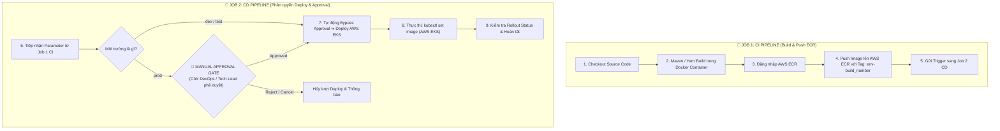

# 🏗️ Hướng Dẫn Chi Tiết Build Từng Service & Tích Hợp Jenkins Flow Tách Biệt CI & CD (Bypass Dev/Test, Approval Cho Prod)

Tài liệu này hướng dẫn quy trình CI/CD chuẩn doanh nghiệp được tách thành **2 Job độc lập trong Jenkins**:
* 🔹 **Job 1 (CI - Continuous Integration):** Biên dịch mã nguồn, đóng gói Docker Container và Push Image lên **AWS ECR**.
* 🔸 **Job 2 (CD - Continuous Deployment):** Tự động deploy cho **`dev`** và **`test`** (Bypass Approval); Yêu cầu **Manual Approval (Phê duyệt thủ công)** bắt buộc đối với môi trường **`prod`**.

---

## 🔀 1. Mô Hình Luồng CI & CD Tách Biệt (Two-Job Architecture)



---

## ☁️ 2. Quy Định Tagging AWS ECR Cho Đa Môi Trường

* **AWS ECR Registry:** `<AWS_ACCOUNT_ID>.dkr.ecr.<AWS_REGION>.amazonaws.com/xianzhu/<service_name>`
* **Cú pháp Tag Image theo môi trường:**
  * 🟢 **Môi trường `dev`:** `dev-${BUILD_NUMBER}` (Tự động Deploy)
  * 🟡 **Môi trường `test`:** `test-${BUILD_NUMBER}` (Tự động Deploy)
  * 🔴 **Môi trường `prod`:** `v${BUILD_NUMBER}` (Cần Phê Duyệt Thủ Công)

---

## 🤖 3. Mẫu JOB 1: CI PIPELINE (`Jenkinsfile.ci`)

Job này thực hiện **Build & Push lên AWS ECR**, sau đó tự động kích hoạt Job CD:

```groovy
pipeline {
    agent {
        docker {
            image 'maven:3.9.6-eclipse-temurin-21'
            args '-v /var/cache/m2:/root/.m2 -v /var/run/docker.sock:/var/run/docker.sock'
        }
    }

    parameters {
        choice(name: 'ENVIRONMENT', choices: ['dev', 'test', 'prod'], description: 'Môi Trường Đích')
        choice(
            name: 'SERVICE_NAME',
            choices: ['gateway', 'consumer', 'goods', 'order', 'auth', 'user', 'payment', 'supplier', 'promotion', 'statistics', 'distribution', 'im'],
            description: 'Chọn Service Cần Build'
        )
        string(name: 'AWS_REGION', defaultValue: 'us-east-1', description: 'AWS Region ECR')
        string(name: 'AWS_ACCOUNT_ID', defaultValue: '123456789012', description: 'AWS Account ID')
    }

    environment {
        CODE_DIR = 'source-code/S2B2B2C-Service'
        ECR_REGISTRY = "${params.AWS_ACCOUNT_ID}.dkr.ecr.${params.AWS_REGION}.amazonaws.com"
        IMAGE_TAG = "${params.ENVIRONMENT}-${BUILD_NUMBER}"
    }

    stages {
        stage('Checkout Code') {
            steps { checkout scm }
        }

        stage('Determine Target Path') {
            steps {
                script {
                    if (params.SERVICE_NAME == 'gateway') {
                        env.MODULE_PATH = 'gateway'
                    } else if (params.SERVICE_NAME == 'consumer') {
                        env.MODULE_PATH = 'service/consumer'
                    } else {
                        env.MODULE_PATH = "service/${params.SERVICE_NAME}-service"
                    }
                }
            }
        }

        stage('Maven Package') {
            steps {
                dir("${env.CODE_DIR}") {
                    sh "mvn clean package -DskipTests -Prelease -Drevision=${BUILD_NUMBER} -pl ${env.MODULE_PATH} -am"
                }
            }
        }

        stage('AWS ECR Login and Push') {
            steps {
                script {
                    def fullImageName = "${env.ECR_REGISTRY}/xianzhu/${params.SERVICE_NAME}:${env.IMAGE_TAG}"
                    dir("${env.CODE_DIR}/${env.MODULE_PATH}") {
                        sh """
                            aws ecr get-login-password --region ${params.AWS_REGION} | docker login --username AWS --password-stdin ${env.ECR_REGISTRY}
                            docker build -t ${fullImageName} .
                            docker push ${fullImageName}
                        """
                    }
                }
            }
        }

        stage('Trigger Job CD') {
            steps {
                script {
                    echo "Triggering CD Pipeline for environment: ${params.ENVIRONMENT}..."
                    build job: 'XianZhu-CD-Pipeline',
                        parameters: [
                            string(name: 'ENVIRONMENT', value: params.ENVIRONMENT),
                            string(name: 'SERVICE_NAME', value: params.SERVICE_NAME),
                            string(name: 'IMAGE_TAG', value: env.IMAGE_TAG),
                            string(name: 'AWS_REGION', value: params.AWS_REGION),
                            string(name: 'AWS_ACCOUNT_ID', value: params.AWS_ACCOUNT_ID)
                        ],
                        wait: false
                }
            }
        }
    }

    post {
        success { echo "Job CI for ${params.SERVICE_NAME} completed successfully." }
        failure { echo "Job CI for ${params.SERVICE_NAME} failed." }
    }
}
```

---

## 🛑 4. Mẫu JOB 2: CD PIPELINE (Bypass Dev/Test, Approval Cho Prod) (`Jenkinsfile.cd`)

Job này tự động triển khai với `dev` và `test`, và yêu cầu **Manual Approval Gate** khi triển khai tới `prod`:

```groovy
pipeline {
    agent any

    parameters {
        string(name: 'ENVIRONMENT', defaultValue: 'dev', description: 'Môi trường triển khai (dev/test/prod)')
        string(name: 'SERVICE_NAME', defaultValue: 'order', description: 'Tên Service triển khai')
        string(name: 'IMAGE_TAG', defaultValue: 'dev-1', description: 'Tag Docker Image trên ECR')
        string(name: 'AWS_REGION', defaultValue: 'us-east-1', description: 'AWS Region')
        string(name: 'AWS_ACCOUNT_ID', defaultValue: '123456789012', description: 'AWS Account ID')
    }

    environment {
        ECR_REGISTRY = "${params.AWS_ACCOUNT_ID}.dkr.ecr.${params.AWS_REGION}.amazonaws.com"
        TARGET_NAMESPACE = "xianzhu-${params.ENVIRONMENT}"
    }

    stages {
        stage('Approval Gate') {
            steps {
                script {
                    def fullImageName = "${env.ECR_REGISTRY}/xianzhu/${params.SERVICE_NAME}:${params.IMAGE_TAG}"
                    
                    if (params.ENVIRONMENT == 'dev' || params.ENVIRONMENT == 'test') {
                        echo "======================================================================"
                        echo "Bypassing manual approval for environment: ${params.ENVIRONMENT.toUpperCase()}"
                        echo "Auto deploying service ${params.SERVICE_NAME} (Tag: ${params.IMAGE_TAG})"
                        echo "======================================================================"
                        env.APPROVER_USER = 'AUTOMATIC_BYPASS'
                    } else {
                        echo "======================================================================"
                        echo "MANUAL APPROVAL REQUIRED FOR PRODUCTION DEPLOYMENT"
                        echo "Environment: [ ${params.ENVIRONMENT.toUpperCase()} ]"
                        echo "Service: [ ${params.SERVICE_NAME} ]"
                        echo "ECR Image: ${fullImageName}"
                        echo "======================================================================"

                        timeout(time: 24, unit: 'HOURS') {
                            input id: 'DeployApproval',
                                  message: "Approve deployment of ${params.SERVICE_NAME} (${params.IMAGE_TAG}) to PRODUCTION?",
                                  ok: 'Approve Deploy',
                                  submitterParameter: 'APPROVER_USER'
                        }

                        echo "Production deployment approved by user: ${env.APPROVER_USER}"
                    }
                }
            }
        }

        stage('Deploy to AWS EKS / K8s') {
            steps {
                script {
                    def deploymentName = (params.SERVICE_NAME == 'gateway' || params.SERVICE_NAME == 'consumer') ? params.SERVICE_NAME : "${params.SERVICE_NAME}-api"
                    def fullImageName = "${env.ECR_REGISTRY}/xianzhu/${params.SERVICE_NAME}:${params.IMAGE_TAG}"

                    sh """
                        echo "Deploying ${deploymentName} to EKS Namespace ${env.TARGET_NAMESPACE}..."
                        kubectl set image deployment/${deploymentName} ${deploymentName}=${fullImageName} -n ${env.TARGET_NAMESPACE}
                        kubectl rollout status deployment/${deploymentName} -n ${env.TARGET_NAMESPACE} --timeout=180s
                    """
                }
            }
        }
    }

    post {
        success {
            echo "Deployment of ${params.SERVICE_NAME} to ${params.ENVIRONMENT} completed successfully."
        }
        failure {
            echo "Deployment of ${params.SERVICE_NAME} failed or rejected."
        }
    }
}
```

---

## 🎨 5. Mẫu Job CI & CD Cho Frontend UI

Tương tự Backend, luồng Frontend UI được cấu hình:
1. **Job `XianZhu-UI-CI`:** Build Vue.js dist qua `node:22-alpine` ➔ Push ECR Image ➔ Trigger `XianZhu-UI-CD`.
2. **Job `XianZhu-UI-CD`:** Tự động Bypass cho `dev` / `test`; Dừng chờ **Manual Approval** khi deploy `prod`.
