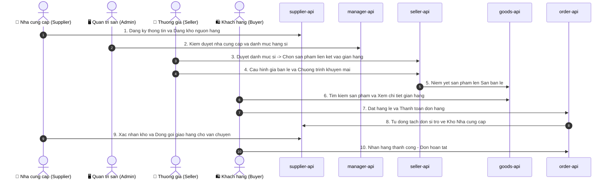
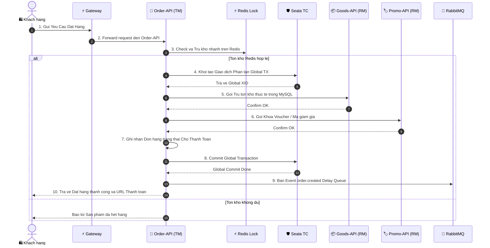
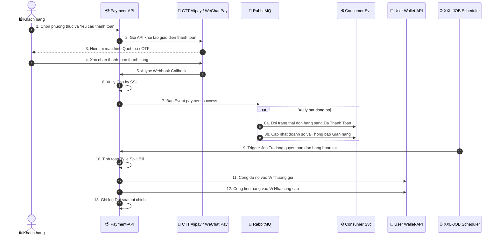

# 📐 Sơ Đồ Kết Nối Các Services & Phân Tích Luồng Nghiệp Vụ (Workflows)

Tài liệu này cung cấp **Sơ đồ kết nối tổng thể (Connection Diagram)** giữa các Client, Gateway, Microservices và Hạ tầng Middleware, cùng với **Phân tích các Luồng nghiệp vụ chính (Core Workflows)** và **Bảng giải thích quy trình chi tiết** trong hệ thống **Lilishop / XianZhu S2B2C**.

---

## 🗺️ 1. Sơ Đồ Kết Nối Tổng Thể Các Services (System Connection Diagram)

```mermaid
graph TB
    subgraph ClientLayer["📱 CLIENT LAYER - Giao diện người dùng"]
        BuyerUI["🛍️ Buyer Client (PC / H5 / MiniApp)"]
        SellerUI["🏪 Seller Portal (Thương gia)"]
        SupplierUI["🚚 Supplier Portal (Nhà cung cấp)"]
        AdminUI["🖥️ Manager Portal (Quản trị sàn)"]
        IMClient["💬 IM Chat Client (Ứng dụng Chat)"]
    end

    subgraph EntryLayer["🌐 ENTRY AND GATEWAY LAYER"]
        Nginx["🌐 Nginx Ingress / Web Server"]
        Gateway["⚡ Spring Cloud Gateway (Port 8888)"]
    end

    subgraph ServiceLayer["☕ MICROSERVICES BUSINESS LAYER"]
        AuthSvc["🔐 auth-api"]
        UserSvc["👤 user-api / member-api"]
        GoodsSvc["📦 goods-api"]
        OrderSvc["🛒 order-api"]
        PaymentSvc["💳 payment-api"]
        PromoSvc["🏷️ promotion-api"]
        SupplierSvc["🏬 supplier-api"]
        IMSvc["💬 im-api (WebSocket Port 11130)"]
        ConsumerSvc["⚙️ consumer (Async Event Listener)"]
    end

    subgraph InfraLayer["🗄️ MIDDLEWARE INFRASTRUCTURE LAYER"]
        Nacos["🌀 Nacos 2.x (Registry & Config)"]
        Seata["🛡️ Seata 1.6 (Distributed TX)"]
        XXL["⏰ XXL-JOB 2.4 (Job Scheduler)"]
        Redis["⚡ Redis 7.0 (Cache & Redisson Lock)"]
        MySQL["🗄️ MySQL 8.0 (Master Database)"]
        ES["🔍 Elasticsearch 7.17 (Search Engine)"]
        RabbitMQ["🐰 RabbitMQ 3.x (Message Broker)"]
    end

    BuyerUI --> Nginx
    SellerUI --> Nginx
    SupplierUI --> Nginx
    AdminUI --> Nginx
    IMClient --> IMSvc

    Nginx --> Gateway

    Gateway --> AuthSvc
    Gateway --> UserSvc
    Gateway --> GoodsSvc
    Gateway --> OrderSvc
    Gateway --> PaymentSvc
    Gateway --> PromoSvc
    Gateway --> SupplierSvc

    ServiceLayer --> Nacos
    OrderSvc --> Seata
    GoodsSvc --> Seata
    UserSvc --> Seata

    OrderSvc --> Redis
    GoodsSvc --> Redis
    AuthSvc --> Redis
    PaymentSvc --> Redis

    ServiceLayer --> MySQL
    GoodsSvc --> ES
    BuyerUI --> ES

    OrderSvc --> RabbitMQ
    PaymentSvc --> RabbitMQ
    GoodsSvc --> RabbitMQ
    RabbitMQ --> ConsumerSvc
    ConsumerSvc --> ES
    ConsumerSvc --> MySQL

    XXL --> OrderSvc
    XXL --> PaymentSvc

    %% Vibrant Color Styling
    style ClientLayer fill:#e0f2fe,stroke:#0284c7,stroke-width:2px,color:#0369a1
    style EntryLayer fill:#fef3c7,stroke:#d97706,stroke-width:2px,color:#92400e
    style ServiceLayer fill:#dcfce7,stroke:#16a34a,stroke-width:2px,color:#15803d
    style InfraLayer fill:#f3e8ff,stroke:#9333ea,stroke-width:2px,color:#6b21a8

    style BuyerUI fill:#ffffff,stroke:#0284c7,color:#0f172a
    style SellerUI fill:#ffffff,stroke:#0284c7,color:#0f172a
    style SupplierUI fill:#ffffff,stroke:#0284c7,color:#0f172a
    style AdminUI fill:#ffffff,stroke:#0284c7,color:#0f172a
    style IMClient fill:#ffffff,stroke:#0284c7,color:#0f172a

    style Nginx fill:#ffffff,stroke:#d97706,color:#0f172a
    style Gateway fill:#ffffff,stroke:#d97706,color:#0f172a

    style AuthSvc fill:#ffffff,stroke:#16a34a,color:#0f172a
    style UserSvc fill:#ffffff,stroke:#16a34a,color:#0f172a
    style GoodsSvc fill:#ffffff,stroke:#16a34a,color:#0f172a
    style OrderSvc fill:#ffffff,stroke:#16a34a,color:#0f172a
    style PaymentSvc fill:#ffffff,stroke:#16a34a,color:#0f172a
    style PromoSvc fill:#ffffff,stroke:#16a34a,color:#0f172a
    style SupplierSvc fill:#ffffff,stroke:#16a34a,color:#0f172a
    style IMSvc fill:#ffffff,stroke:#16a34a,color:#0f172a
    style ConsumerSvc fill:#ffffff,stroke:#16a34a,color:#0f172a

    style Nacos fill:#ffffff,stroke:#9333ea,color:#0f172a
    style Seata fill:#ffffff,stroke:#9333ea,color:#0f172a
    style XXL fill:#ffffff,stroke:#9333ea,color:#0f172a
    style Redis fill:#ffffff,stroke:#9333ea,color:#0f172a
    style MySQL fill:#ffffff,stroke:#9333ea,color:#0f172a
    style ES fill:#ffffff,stroke:#9333ea,color:#0f172a
    style RabbitMQ fill:#ffffff,stroke:#9333ea,color:#0f172a
```

---

## 🔄 2. Phân Tích Chi Tiết 3 Luồng Nghiệp Vụ (Workflows & Tables)

---

### 🔄 Workflow 1: Luồng S2B2C Nguồn Hàng (Supplier ➔ Seller ➔ Buyer)

#### 📋 Bảng Giải Thích Chi Tiết Luồng S2B2C Nguồn Hàng

| STT | Thành Phần Thực Hiện | Hành Động / Tác Vụ Chi Tiết | Microservice / Database | Mục Đích & Kết Quả |
| :---: | :--- | :--- | :--- | :--- |
| **1** | **Nhà cung cấp (Supplier)** | Đăng ký tài khoản doanh nghiệp, tải hồ sơ năng lực và khai báo sản phẩm sỉ (Wholesale SKU). | `supplier-api` `supplier-db` | Lưu hồ sơ kho hàng sỉ vào hệ thống. |
| **2** | **Quản trị sàn (Admin)** | Kiểm tra tính pháp lý của Supplier và duyệt danh mục mặt hàng sỉ. | `manager-api` `system-api` | Kích hoạt trạng thái nguồn hàng sỉ sẵn sàng phân phối. |
| **3** | **Thương gia (Seller)** | Lướt danh mục chợ sỉ S2B, bấm chọn các sản phẩm muốn đưa vào Cửa hàng bán lẻ của mình. | `seller-api` `goods-api` | Thiết lập liên kết phân phối mà không cần nhập kho thực tế. |
| **4** | **Thương gia (Seller)** | Định giá bán lẻ (Retail Price), thiết lập quy tắc lợi nhuận và chương trình KM riêng. | `seller-api` `promotion-api` | Xác định biên lợi nhuận: $\text{Lợi Nhuận} = \text{Giá Lẻ} - \text{Giá Sỉ}$. |
| **5** | **Hệ Thống (Seller System)** | Niêm yết sản phẩm lên Sàn bán lẻ công khai và đồng bộ chỉ mục tìm kiếm. | `goods-api` `Elasticsearch` | Khách hàng có thể tìm kiếm sản phẩm trên web/app. |
| **6** | **Khách hàng (Buyer)** | Tìm kiếm từ khóa, xem thông tin gian hàng và thêm sản phẩm vào giỏ hàng. | `goods-api` `buyer-ui` | Khởi tạo quy trình mua sắm của người dùng cuối. |
| **7** | **Khách hàng (Buyer)** | Đặt hàng lẻ và thực hiện thanh toán trực tuyến. | `order-api` `payment-api` | Đơn hàng tạo thành công trạng thái *Đã Thanh Toán*. |
| **8** | **Hệ Thống (Order System)** | Tự động phân tích SKU trong đơn hàng và **tách đơn sỉ trỏ thẳng về kho của Supplier**. | `order-api` `supplier-api` | Thực hiện quy trình Drop-shipping tự động. |
| **9** | **Nhà cung cấp (Supplier)** | Nhận thông báo đơn sỉ, in phiếu giao hàng, đóng gói và bàn giao đơn vị vận chuyển. | `supplier-api` `logistics` | Xuất kho giao hàng trực tiếp tới tay Buyer. |
| **10** | **Khách hàng (Buyer)** | Nhận hàng thành công, xác nhận hoàn tất đơn hàng. | `order-api` `user-api` | Đơn hàng khép lại, sẵn sàng cho bước quyết toán tiền. |

---

### 🔄 Workflow 2: Luồng Đặt Hàng & Giao Dịch Phân Tán (Order Creation & Seata 2PC)

#### 📋 Bảng Giải Thích Chi Tiết Luồng Đặt Hàng & Giao Dịch Phân Tán

| STT | Bước / Thành Phần | Nội Dung Thao Tác Chi Tiết | Cơ Chế Bảo Vệ & Kỹ Thuật | Kết Quả / Xử Lý Ngoại Lệ |
| :---: | :--- | :--- | :--- | :--- |
| **1-2** | **Buyer ➔ Gateway** | Khách gửi request Đặt hàng. Gateway xác thực JWT và chuyển tới `order-api`. | `Spring Cloud Gateway` `JWT Verification` | Request hợp lệ được phép đi tiếp vào Service. |
| **3** | **Order-API ➔ Redis** | Kiểm tra và khấu trừ ngay số lượng tồn kho trên Redis RAM bằng hàm Atomic Decr. | `Redis Redisson Lock` `Lua Script` | **Chống Oversold (Bán lố):** Trả về ngay lỗi nếu kho hết mà không cần chọc xuống DB. |
| **4** | **Order-API ➔ Seata** | Khởi tạo giao dịch toàn cục (Global Transaction) với Seata Transaction Coordinator. | `Seata AT Protocol` `Global XID` | Cấp phát mã `XID` định danh chuỗi giao dịch phân tán. |
| **5** | **Order-API ➔ Goods-API** | Gọi `goods-api` để trừ số lượng tồn kho thực tế trong MySQL DB của dịch vụ hàng hóa. | `Resource Manager (RM)` `MySQL Lock` | Tồn kho trong DB chính thức giảm. |
| **6** | **Order-API ➔ Promo-API** | Gọi `promotion-api` để khóa mã giảm giá/voucher mà khách sử dụng cho đơn hàng. | `Resource Manager (RM)` `Promo DB` | Trạng thái Voucher chuyển sang *Đang Sử Dụng*. |
| **7-8** | **Order-API ➔ Seata** | Ghi nhận đơn hàng *Chờ Thanh Toán* và gửi yêu cầu Commit Global TX tới Seata. | `Seata Two-Phase Commit` `2PC Commit` | **Nếu 1 bước lỗi:** Seata tự động kích hoạt **Rollback** hoàn kho và voucher lập tức. |
| **9** | **Order-API ➔ RabbitMQ** | Đưa sự kiện `order.created` vào hàng đợi trễ (TTL 30 phút) để chờ sự kiện thanh toán. | `RabbitMQ Delay Queue` `AMQP Exchange` | Chuẩn bị cơ chế tự động hủy đơn khi hết hạn 30p. |
| **10** | **Order-API ➔ Buyer** | Trả về phản hồi thành công kèm Mã đơn hàng & Đường dẫn Cổng thanh toán. | `JSON Response` | Màn hình Khách hàng chuyển sang bước Quét mã trả tiền. |

---

### 🔄 Workflow 3: Luồng Thanh Toán & Phân Chia Doanh Thu (Payment Split & Settlement)

#### 📋 Bảng Giải Thích Chi Tiết Luồng Thanh Toán & Phân Chia Doanh Thu

| STT | Bước / Thành Phần | Quy Trình Thao Tác Chi Tiết | Công Thức / Logic Tính Toán | Kết Quả Hệ Thống |
| :---: | :--- | :--- | :--- | :--- |
| **1-3** | **PaySvc ➔ Cổng TT** | Khách chọn cổng WeChat/Alipay. `payment-api` khởi tạo mã QR / SDK thanh toán. | `RSA2048 / HMAC-SHA256` `Payment Sign` | Màn hình thanh toán xuất hiện trên App khách. |
| **4-6** | **Cổng TT ➔ PaySvc** | Cổng thanh toán gửi Webhook báo kết quả. PaySvc kiểm tra chữ ký SSL để tránh giả mạo. | `Webhook Signature Check` `Idempotent Key` | Đảm bảo tính chống lặp (Idempotent) giao dịch. |
| **7-8** | **PaySvc ➔ RabbitMQ** | Bắn tin nhắn `payment.success` vào RabbitMQ. Service `consumer` nhận tin xử lý ngầm. | `Message Queue Async` `Fanout Exchange` | Cập nhật đơn hàng *Đã Thanh Toán* & báo chuông cho Gian hàng mà không làm lag cổng pay. |
| **9** | **XXL-JOB ➔ PaySvc** | Định kỳ hàng ngày/tuần, XXL-JOB trigger tiến trình "Auto Settlement Bill". | `XXL-JOB Cron Schedule` `Cron Expression` | Kích hoạt tiến trình chia tiền tự động. |
| **10** | **Payment-API** | Tính toán phân bổ tiền theo hợp đồng chiết khấu của từng Gian hàng và Supplier. | $\text{Ví Seller} = \text{Tổng Lẻ} - \text{Hoa Hồng Sàn} - \text{Giá Sỉ}$ $\text{Ví Supplier} = \text{Giá Sỉ Gốc}$ | Xác định chính xác số tiền thuộc về mỗi bên. |
| **11-12**| **PaySvc ➔ User-API** | Chuyển tiền tự động vào Ví điện tử nội bộ (Internal Wallet) của Thương gia và Supplier. | `user-api` `Wallet Balance Transaction` | Số dư khả dụng của Seller & Supplier tăng lên, có thể rút về Bank. |
| **13** | **Payment-API** | Tạo file và dòng log đối soát tài chính (Financial Settlement Record). | `payment-db` `Audit Log` | Lưu vết đầy đủ phục vụ kế toán & kiểm toán sàn. |
