# XianZhu S2B2C - Docker Compose Deployment Guide

Tài liệu này hướng dẫn chi tiết cách triển khai, cấu hình, quản lý cụm dịch vụ **XianZhu / Lilishop S2B2C** bằng **Docker Compose**, bao gồm sơ đồ kết nối giữa các dịch vụ (Services Network Diagram), danh sách cổng (Ports), tài khoản/mật khẩu mặc định và các lệnh vận hành.

---

## 📑 Mục lục
1. [Tổng quan hệ thống](#1-tổng-quan-hệ-thống)
2. [Sơ đồ kết nối giữa các Service (Architecture Diagram)](#2-sơ-đồ-kết-nối-giữa-các-service-architecture-diagram)
3. [Thông tin tài khoản, Mật khẩu & Port](#3-thông-tin-tài-khoản-mật-khẩu--port)
4. [Cấu trúc hạ tầng & Giới hạn tài nguyên](#4-cấu-trúc-hạ-tầng--giới-hạn-tài-nguyên)
5. [Hướng dẫn vận hành & Thao tác lệnh](#5-hướng-dẫn-vận-hành--thao-tác-lệnh)
6. [Cấu trúc thư mục operation/builds/](#6-cấu-trúc-thư-mục-operationbuilds)

---

## 1. Tổng quan hệ thống

Cụm ứng dụng **XianZhu S2B2C** được đóng gói hoàn chỉnh trong `docker-compose.yml` gồm 3 tầng chính:

1. **Middleware Services (Hạ tầng trung trạm)**:
   - **MySQL 8.0**: Cơ sở dữ liệu quan hệ chính (`lilishop`).
   - **Redis 7.0**: Cache và quản lý phiên (session).
   - **Nacos 2.2**: Service Discovery & Dynamic Configuration Center.
   - **RabbitMQ 3.12**: Message Broker phục vụ xử lý bất đồng bộ.
   - **Elasticsearch 7.17**: Engine tìm kiếm sản phẩm và dữ liệu lớn.

2. **Backend Microservices (Java 21 / Spring Cloud)**:
   - **Gateway Service** (`:8888`): Cổng điều hướng API duy nhất cho toàn bộ hệ thống.
   - **Auth Service**: Xác thực người dùng, phân quyền OAuth2/JWT.
   - **User Service**: Quản lý thông tin người dùng, tài khoản.
   - **Goods Service**: Quản lý hàng hóa, danh mục, kho bãi.
   - **Order Service**: Quản lý đơn hàng, giỏ hàng, thanh toán.
   - **Consumer Service**: Xử lý các công việc ngầm (Background Workers) lắng nghe từ RabbitMQ.
   - **XianZhu Service**: Nghiệp vụ cốt lõi dành riêng cho mô hình XianZhu S2B2C.

3. **Frontend UI Service (Nginx Web Server)**:
   - **Buyer UI**: Giao diện dành cho Người mua (truy cập `/` hoặc `/buyer/`).
   - **Seller UI**: Giao diện dành cho Người bán (truy cập `/seller/`).
   - Reverse Proxy: Tự động điều hướng các request `/api/` về Gateway Backend.

---

## 2. Sơ đồ kết nối giữa các Service (Architecture Diagram)

Sơ đồ dưới đây thể hiện luồng kết nối giữa Người dùng (Client Browser), Nginx Frontend, Gateway API, các Java Microservices và các Trung trạm Middleware:

```mermaid
flowchart TD
    %% ==========================================
    %% COLOR & STYLE DEFINITIONS
    %% ==========================================
    classDef client fill:#E3F2FD,stroke:#1565C0,stroke-width:2px,color:#0D47A1;
    classDef frontend fill:#E8F5E9,stroke:#2E7D32,stroke-width:2px,color:#1B5E20;
    classDef gateway fill:#FFF3E0,stroke:#EF6C00,stroke-width:3px,color:#E65100;
    classDef nacos fill:#F3E5F5,stroke:#8E24AA,stroke-width:2px,color:#4A148C;
    classDef service fill:#FFFDE7,stroke:#FBC02D,stroke-width:2px,color:#F57F17;
    classDef db fill:#E0F7FA,stroke:#00838F,stroke-width:2px,color:#006064;

    %% ------------------------------------------
    %% LAYER 1: CLIENT
    %% ------------------------------------------
    subgraph L1 ["🌐 LAYER 1: CLIENT / NGƯỜI DÙNG"]
        BUYER["🛒 Buyer UI Client<br>(Khách mua sắm)"]
        SELLER["🏪 Seller UI Client<br>(Kênh người bán)"]
    end

    %% ------------------------------------------
    %% LAYER 2: FRONTEND (WEB SERVER)
    %% ------------------------------------------
    subgraph L2 ["🎨 LAYER 2: FRONTEND LAYER"]
        NGINX["⚡ Nginx Web Server<br>(xianzhu-buyer-ui | Port: 80)"]
    end

    %% ------------------------------------------
    %% LAYER 3: API GATEWAY & DISCOVERY
    %% ------------------------------------------
    subgraph L3 ["🚪 LAYER 3: API GATEWAY & NACOS DISCOVERY"]
        GATEWAY["🛡️ Gateway API Service<br>(xianzhu-gateway | Port: 8888)"]
        NACOS["⚙️ Nacos Center<br>(xianzhu-nacos | Ports: 8848/9848)"]
    end

    %% ------------------------------------------
    %% LAYER 4: BACKEND MICROSERVICES
    %% ------------------------------------------
    subgraph L4 ["☕ LAYER 4: BACKEND MICROSERVICES (JAVA 21)"]
        AUTH["🔑 Auth Service<br>(xianzhu-auth-service)"]
        USER["👤 User Service<br>(xianzhu-user-service)"]
        GOODS["📦 Goods Service<br>(xianzhu-goods-service)"]
        ORDER["🧾 Order Service<br>(xianzhu-order-service)"]
        XIANZHU["🐖 XianZhu Service<br>(xianzhu-xianzhu-service)"]
        CONSUMER["⚡ Consumer Worker<br>(xianzhu-consumer)"]
    end

    %% ------------------------------------------
    %% LAYER 5: DATA STORAGE & MIDDLEWARE
    %% ------------------------------------------
    subgraph L5 ["💾 LAYER 5: DATA STORAGE & MIDDLEWARE (ĐÁY HỆ THỐNG)"]
        MYSQL[("🐬 MySQL Database 8.0<br>(xianzhu-mysql | Port: 3306 | DB: lilishop)")]
        REDIS[("🔴 Redis Cache 7.0<br>(xianzhu-redis | Port: 6379)")]
        RABBITMQ["🐇 RabbitMQ Broker<br>(xianzhu-rabbitmq | Ports: 5672/15672)"]
        ES[("🔍 Elasticsearch 7.17<br>(xianzhu-elasticsearch | Port: 9200)")]
    end

    %% ------------------------------------------
    %% LUỒNG KẾT NỐI THEO TẦNG CHI TIẾT
    %% ------------------------------------------
    BUYER & SELLER -->|"HTTP GET Port 80"| NGINX
    NGINX -->|"Proxy API /api/*"| GATEWAY
    GATEWAY <-->|"Service Discovery"| NACOS

    GATEWAY --> AUTH & USER & GOODS & ORDER & XIANZHU

    AUTH & USER & GOODS & ORDER & XIANZHU & CONSUMER -.->|"Register & Config"| NACOS

    AUTH & USER & GOODS & ORDER & XIANZHU -->|"SQL Queries"| MYSQL
    AUTH & USER & GOODS & ORDER & XIANZHU -->|"Cache Session"| REDIS
    GOODS & ORDER -->|"Index Search"| ES
    GOODS & ORDER & XIANZHU -->|"Publish Event"| RABBITMQ
    CONSUMER -->|"Consume Tasks"| RABBITMQ

    %% APPLY STYLES
    class BUYER,SELLER client;
    class NGINX frontend;
    class GATEWAY gateway;
    class NACOS nacos;
    class AUTH,USER,GOODS,ORDER,XIANZHU,CONSUMER service;
    class MYSQL,REDIS,RABBITMQ,ES db;
```



---

## 3. Thông tin tài khoản, Mật khẩu & Port

Dưới đây là bảng tổng hợp tất cả các dịch vụ, tên container, Cổng (Port) giao tiếp và **Mật khẩu/Tài khoản truy cập**:

| Dịch vụ | Tên Container | Port Ngoài / Trong | Tài khoản / Password | Thông tin chi tiết |
| :--- | :--- | :--- | :--- | :--- |
| **MySQL** | `xianzhu-mysql` | `3306:3306` | **User**: `root`<br>**Password**: `lilishop` | Database default: `lilishop`<br>Charset: `utf8mb4` |
| **Redis** | `xianzhu-redis` | `6379:6379` | **Password**: `lilishop` | Max memory: `128MB`<br>Policy: `volatile-lru` |
| **Nacos Console** | `xianzhu-nacos` | `8848:8848`<br>`9848:9848` (gRPC) | **User**: `nacos`<br>**Password**: `nacos` | Dashboard: `http://localhost:8848/nacos` |
| **RabbitMQ Admin** | `xianzhu-rabbitmq` | `5672:5672` (AMQP)<br>`15672:15672` (Web) | **User**: `admin`<br>**Password**: `lilishop` | Dashboard: `http://localhost:15672` |
| **Elasticsearch** | `xianzhu-elasticsearch` | `9200:9200` | Không yêu cầu auth (Single-node) | REST API: `http://localhost:9200` |
| **Gateway Service** | `xianzhu-gateway` | `8888:8888` | N/A | Entry API: `http://localhost:8888` |
| **Buyer UI (Nginx)** | `xianzhu-buyer-ui` | `80:80` | N/A | Buyer: `http://localhost/`<br>Seller: `http://localhost/seller/` |
| **Auth Service** | `xianzhu-auth-service` | Nội bộ | N/A | Kết nối qua Gateway & Nacos |
| **User Service** | `xianzhu-user-service` | Nội bộ | N/A | Kết nối qua Gateway & Nacos |
| **Goods Service** | `xianzhu-goods-service` | Nội bộ | N/A | Kết nối qua Gateway & Nacos |
| **Order Service** | `xianzhu-order-service` | Nội bộ | N/A | Kết nối qua Gateway & Nacos |
| **Supplier Service** | `xianzhu-supplier-service` | Nội bộ | N/A | Kết nối qua Gateway & Nacos |
| **System Service** | `xianzhu-system-service` | Nội bộ | N/A | Kết nối qua Gateway & Nacos |
| **Payment Service** | `xianzhu-payment-service` | Nội bộ | N/A | Kết nối qua Gateway & Nacos |
| **Promotion Service** | `xianzhu-promotion-service` | Nội bộ | N/A | Kết nối qua Gateway & Nacos |
| **Statistics Service** | `xianzhu-statistics-service` | Nội bộ | N/A | Kết nối qua Gateway & Nacos |
| **Resource Service** | `xianzhu-resource-service` | Nội bộ | N/A | Kết nối qua Gateway & Nacos |
| **Broadcast Service** | `xianzhu-broadcast-service` | Nội bộ | N/A | Kết nối qua Gateway & Nacos |
| **IM Service** | `xianzhu-im-service` | `11130:11130` | N/A | Dịch vụ Chat WebSocket |
| **Distribution Service** | `xianzhu-distribution-service` | Nội bộ | N/A | Kết nối qua Gateway & Nacos |
| **Consumer Service** | `xianzhu-consumer` | Nội bộ | N/A | Lắng nghe tin nhắn từ RabbitMQ |
| **XianZhu Service** | `xianzhu-xianzhu-service` | Nội bộ | N/A | Kết nối qua Gateway & Nacos |

---

## 4. Cấu trúc hạ tầng & Giới hạn tài nguyên (Tối ưu cho Máy 8GB RAM Host)

Để hệ thống hoạt động ổn định trên máy chủ có **8GB RAM** mà không bị OOM-Killed (tràn bộ nhớ) hay ảnh hưởng tới hệ điều hành Host (~4GB dành riêng cho MacOS/Linux & Docker Engine), các thông số giới hạn RAM (Memory Limit) và JVM options đã được tinh chỉnh tối ưu (~3.9GB cho toàn bộ cụm containers):

| Container | Image | JVM Config / Command Options | Limits Memory |
| :--- | :--- | :--- | :--- |
| `xianzhu-mysql` | `mysql:8.0.32` | `--innodb_buffer_pool_size=192M --max_connections=80` | `400M` |
| `xianzhu-redis` | `redis:7.0-alpine` | `--maxmemory 128mb --maxmemory-policy volatile-lru` | `150M` |
| `xianzhu-nacos` | `nacos/nacos-server:v2.2.0` | `JVM_XMS=512m`, `JVM_XMX=1024m` | `1G` |
| `xianzhu-rabbitmq` | `rabbitmq:3.12-management-alpine` | Mặc định Alpine Management | `250M` |
| `xianzhu-elasticsearch` | `elasticsearch:7.17.9` | `ES_JAVA_OPTS=-Xms128m -Xmx256m` | `350M` |
| `xianzhu-gateway` | `eclipse-temurin:21-jre-alpine` | `-Xms128m -Xmx256m -XX:MaxMetaspaceSize=128m` | `320M` |
| `xianzhu-auth-service` | `eclipse-temurin:21-jre-alpine` | `-Xms128m -Xmx256m -XX:MaxMetaspaceSize=128m` | `320M` |
| `xianzhu-user-service` | `eclipse-temurin:21-jre-alpine` | `-Xms128m -Xmx256m -XX:MaxMetaspaceSize=128m` | `320M` |
| `xianzhu-goods-service` | `eclipse-temurin:21-jre-alpine` | `-Xms128m -Xmx256m -XX:MaxMetaspaceSize=128m` | `320M` |
| `xianzhu-order-service` | `eclipse-temurin:21-jre-alpine` | `-Xms128m -Xmx256m -XX:MaxMetaspaceSize=128m` | `320M` |
| `xianzhu-supplier-service` | `eclipse-temurin:21-jre-alpine` | `-Xms128m -Xmx256m -XX:MaxMetaspaceSize=128m` | `320M` |
| `xianzhu-system-service` | `eclipse-temurin:21-jre-alpine` | `-Xms128m -Xmx256m -XX:MaxMetaspaceSize=128m` | `320M` |
| `xianzhu-payment-service` | `eclipse-temurin:21-jre-alpine` | `-Xms128m -Xmx256m -XX:MaxMetaspaceSize=128m` | `320M` |
| `xianzhu-promotion-service` | `eclipse-temurin:21-jre-alpine` | `-Xms128m -Xmx256m -XX:MaxMetaspaceSize=128m` | `320M` |
| `xianzhu-statistics-service` | `eclipse-temurin:21-jre-alpine` | `-Xms128m -Xmx256m -XX:MaxMetaspaceSize=128m` | `320M` |
| `xianzhu-resource-service` | `eclipse-temurin:21-jre-alpine` | `-Xms128m -Xmx256m -XX:MaxMetaspaceSize=128m` | `320M` |
| `xianzhu-broadcast-service` | `eclipse-temurin:21-jre-alpine` | `-Xms128m -Xmx256m -XX:MaxMetaspaceSize=128m` | `320M` |
| `xianzhu-im-service` | `eclipse-temurin:21-jre-alpine` | `-Xms128m -Xmx256m -XX:MaxMetaspaceSize=128m` | `320M` |
| `xianzhu-distribution-service` | `eclipse-temurin:21-jre-alpine` | `-Xms128m -Xmx256m -XX:MaxMetaspaceSize=128m` | `320M` |
| `xianzhu-consumer` | `eclipse-temurin:21-jre-alpine` | `-Xms128m -Xmx256m -XX:MaxMetaspaceSize=128m` | `320M` |
| `xianzhu-xianzhu-service` | `eclipse-temurin:21-jre-alpine` | `-Xms128m -Xmx256m -XX:MaxMetaspaceSize=128m` | `320M` |
| `xianzhu-buyer-ui` | `nginx:alpine` | Nginx HTTP Static Server & Reverse Proxy | `64M` |

> 💡 **Tổng dung lượng RAM tối đa cụm Docker xấp xỉ ~3.9 GB**, giúp hệ thống vận hành cực kỳ mượt mà trên các dòng laptop/PC 8GB RAM mà không lo treo máy hay giật lag.

---

## 5. Hướng dẫn vận hành & Thao tác lệnh

### 5.1. Khởi chạy cụm dịch vụ

Di chuyển vào thư mục `operation/builds/`:

**Cách 1: Khởi chạy riêng Backend & Frontend (Khuyên dùng)**
```bash
# 1. Khởi chạy Middleware Services (MySQL, Redis, Nacos, RabbitMQ, ES, Seata)
docker compose -f docker-compose-middleware.yml up -d

# 2. Khởi chạy Backend Microservices (Java JARs)
docker compose -f docker-compose-backend.yml up -d

# 3. Chạy Frontend UI (Nginx)
docker compose -f docker-compose-frontend.yml up -d
```

**Cách 2: Khởi chạy toàn bộ cùng lúc**
```bash
docker compose up -d
```

### 5.2. Kiểm tra trạng thái sức khỏe (Health Check)

Sử dụng script kiểm tra nhanh được tích hợp sẵn:

```bash
./check-health.sh
```

Hoặc xem trạng thái container qua Docker:

```bash
docker compose ps
```

### 5.3. Xem Log vận hành

- **Xem log toàn bộ hệ thống**:
  ```bash
  docker compose logs -f
  ```

- **Xem log riêng từng dịch vụ (ví dụ Gateway hoặc Nacos)**:
  ```bash
  docker compose logs -f gateway
  docker compose logs -f nacos
  docker compose logs -f buyer-ui
  ```

### 5.4. Dừng và dọn dẹp cụm dịch vụ

- **Dừng cụm dịch vụ**:
  ```bash
  docker compose stop
  ```

- **Dừng và xóa toàn bộ container**:
  ```bash
  docker compose down
  ```

---

## 6. Cấu trúc thư mục operation/builds/

```text
operation/builds/
├── README.md             # Tài liệu hướng dẫn Docker Compose (File này)
├── docker-compose.yml    # File cấu hình Docker Compose chính
├── nginx.conf            # Cấu hình Nginx Web Server & API Reverse Proxy
├── check-health.sh       # Script bash kiểm tra nhanh Port và trạng thái Container
├── metadata.json         # Danh sách thông tin phiên bản build & danh sách file JAR
├── backend/              # Chứa các file thực thi Java Backend (.jar)
│   ├── gateway.jar
│   ├── auth-service.jar
│   ├── user-service.jar
│   ├── goods-service.jar
│   ├── order-service.jar
│   ├── consumer.jar
│   ├── xianzhu-service.jar
│   └── ... (các file jar khác)
└── frontend/             # Chứa mã nguồn Web tĩnh đã build
    ├── buyer/            # Static build của phân hệ Buyer UI
    └── seller/           # Static build của phân hệ Seller UI
```
